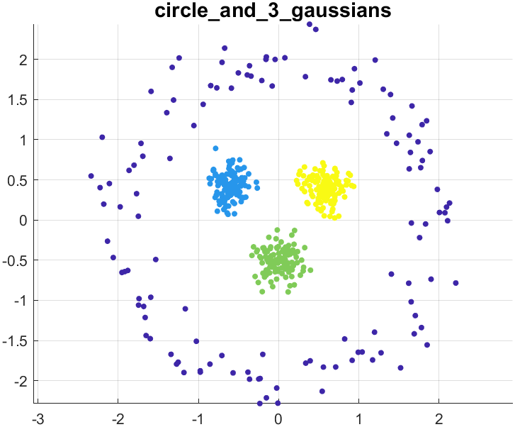
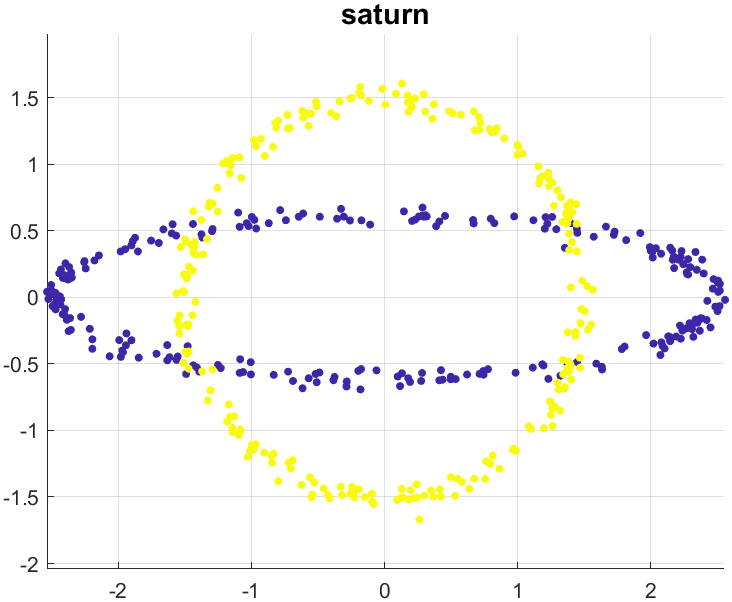

# Synthetic datasets for classification and clustering

This repository contains MATLAB code for generating 2D and 3D synthetic/toy/artificial datasets. The datasets have been previously used in various publications, mostly for rapid testing of classification and clustering methods. A sample of the datasets is also provided (`GeneratedData.zip`)

In addition, we provide an interactive tool for generating a 2D dataset manually (`ManualDataCreation.m`).

## Contents

Currently there are 52 datasets: 47 two-dimensional sets and 5 three-dimensional sets. 

- _Names._ The datasets are named either as the version in the respective publication (if given) or based on the appearance. Since it is nearly impossible to trace the publication where a given dataset, or a similar one, appears for the first time, we are not providing reference sources. The only exception is [1], from which we sourced two vintage datasets (aggregation and gestalt). 

- _Number of points._ Some of the datasets have integer coordinates, which means that they lie on a 2D grid. Since the number of points of these datasets cannot be changed, these datasets are termed **fixed**. For the rest of the datasets, the number of points is a variable _L_, which can be modified in the script generating the data, `TesterData.m`. The sample datasets were generated with _L_ = 500.

- _Class proportions._
The class proportions have been determined to keep original appearance of the dataset, unless a detailed description was provided in one of the sources. Where not specified, we opted for equal proportions.

- _Code._ The code is a stand-alone MATLAB library for generating all 52 datasets. It consists of 11 functions and a script (`TesterData.m`). The dependency tree is shown below.

The script needs the two text files in folder DataFromLiterature: 
`Aggregartion_Safraz19.txt` and `GestaltClusters_Safraz19.txt`,
which were reproduced from [1].

## Deatasets

## References

[[1]. Sarfraz, S., Sharma, V., & Stiefelhagen, R. (2019). Efficient parameter-free clustering using first neighbor relations. In Proceedings of the IEEE/CVF Conference on Computer Vision and Pattern Recognition (pp. 8934-8943).] (https://openaccess.thecvf.com/content_CVPR_2019/papers/Sarfraz_Efficient_Parameter-Free_Clustering_Using_First_Neighbor_Relations_CVPR_2019_paper.pdf)

